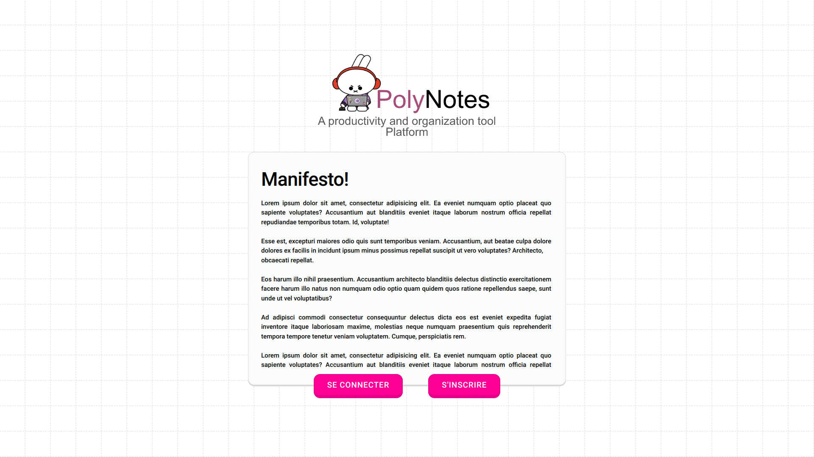
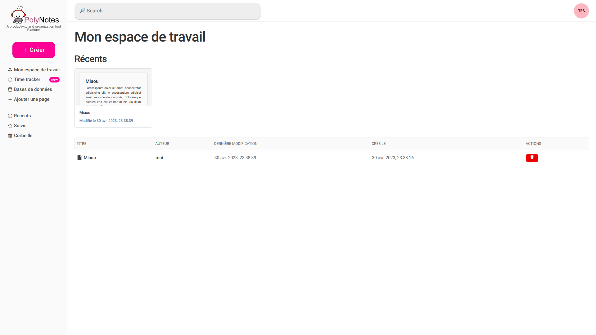
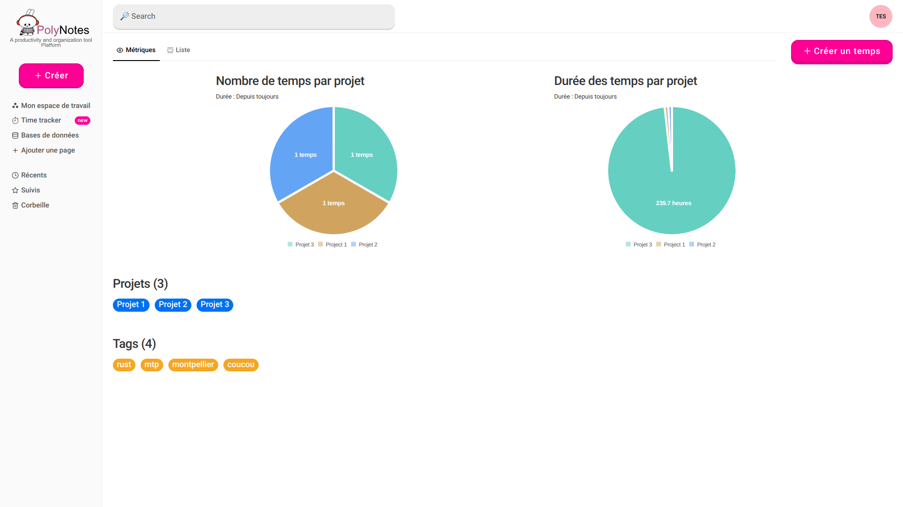
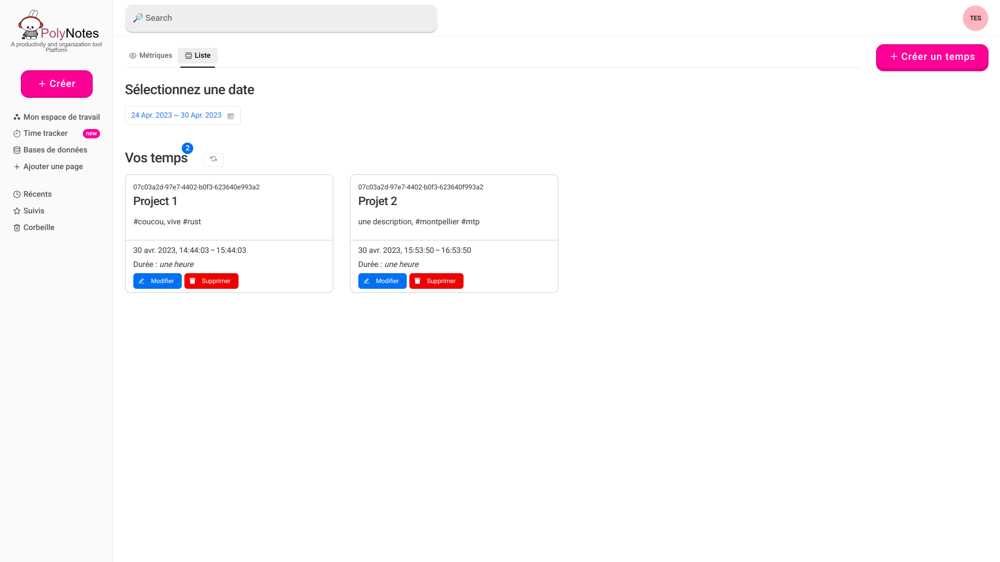

# 📝 Polynotes

A productivity and organization tool platform.

- Frontend: **React** + Emotion + ViteJS (swc)
- Backend: **Rust** + **Axum** + Mongodb driver
- Database: **MongoDB sharded cluster**

➡️ Read the main TAD [here](https://github.com/lapsus-ord/polynotes/wiki)  
➡️ Read the MongoDB TAD [here](./TAD-MONGO.md)

## Screenshots

<div style="display: flex;">
    
    
    
    
</div>

## How to start (dev)

1. **Fill [env file](.env)**

```shell
$ cp .env.dist .env
$ vim .env
```

Complete:

-`MONGO_USER` & `MONGO_PASSWORD`, it will be your credentials
to authenticate you to the mongo cluster
- The `SMTP_*` variables for the mail server (to send emails)
- `BACKEND_BASE_API` with something like `http://localhost:3001/api/v1`
- `FRONTEND_HOST` with `http://localhost:5173` (default port for vite)

2. **Start mongo cluster**

```shell
$ docker compose up -d

# init replica sets & shards (you will have to wait ~25s)
$ ./mongo/init.sh

# to create the user in mongo (for the backend)
$ ./mongo/create-user.sh
```

If you are too lazy to remove all the volumes from the mongos,
I have created a script to remove them.

-> [here `destroy.sh`](./mongo/destroy.sh)

3. **Start [backend](./backend)**

```shell
$ cd backend
$ cargo r
```

4. **Start [frontend](./frontend)**

```shell
$ cd ../frontend
$ yarn dev
```

5. Go to [localhost:5173](http://localhost:5173) (or whichever you choose)

## Documentation

- [Deploy a Sharded Cluster - MongoDB Manual](https://www.mongodb.com/docs/v6.0/tutorial/deploy-shard-cluster/)
- [Configuration File Options - MongoDB Manual](https://www.mongodb.com/docs/manual/reference/configuration-options)
