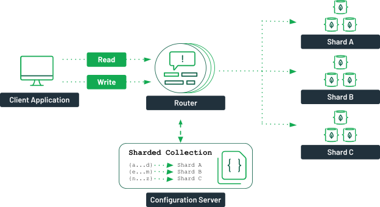

# TAD - MONGO

If you want to install this project locally,
you can read along the [README](./README.md).

- **Chosen subject :** Block Time Manager (time tracking)
- **Production URL :** [time-tracker.cluster-2022-3.dopolytech.fr](https://time-tracker.cluster-2022-3.dopolytech.fr/)
- **Test user :**
	- login: `test@example.com`
	- password: `test1234`

I decided to do this NoSQL project on an iteration on my
Polynotes project, so it's a new branch on the same project
`features/time-tracker`.

<br>

---

## Table of contents

- [Schema](#schema)
- [Mongo](#mongo)
  - [Architecture](#architecture)
  - [Indexes & Shard keys](#indexes--shard-keys)
  - [Aggregation pipelines](#aggregation-pipelines)
- [Routes](#routes)
- [Post-mortem](#post-mortem)

## Schema

To add the time tracking feature to my project, I have chosen
to add a new field in my `user` document:

```json
{
  "timeTracker": {
	"projects": [
	  "Projet 1",
	  "Projet 2",
	  "Projet 3"
	],
	"tags": [
	  "rust",
	  "mtp",
	  "montpellier",
	  "coucou"
	],
	"times": [
	  {
		"uuid": "07c03a2d-97e7-4402-b0f3-623640e993a2",
		"project": "Project 1",
		"description": "#coucou, vive #rust",
		"startingTime": 1682858643,
		"duration": 3600
	  },
	  {
		"uuid": "ec0d5c48-0a34-442d-88d8-a01b42cbbb61",
		"project": "Projet 2",
		"description": "une description, #montpellier #mtp",
		"startingTime": 1682862830,
		"duration": 5000
	  },
	  {
		"uuid": "4b056bea-c1e6-4590-8891-dddd3fae2261",
		"project": "Projet 3",
		"description": "Something I did in react.",
		"startingTime": 1680300000,
		"duration": 862920
	  }
	]
  }
}
```

Each time a `time` document is sent to the backend, an aggregation
will push the project name in the `timeTracker.projects` field and the
same for `timeTracker.tags` field (cf. [Aggregations](#aggregation-pipelines)).

**Pros:**

- Synthetic: by doing nested documents, you don't need
  to have another new collection to store these documents.
  And a `time` block is necessarily linked to a user.
- Separated `projects`/`tags` fields: The projects and tags of user
  can be recovered quickly without doing complex queries.

**Cons:**

- Complex queries: by doing nested documents, we have complex pipelines
  with aggregation that are pretty hard to read.
- Synchronization: When we delete a `time` object, we can have a hard time
  with the project and tags list (orphans values).

## Mongo

### Architecture

For this project, I have chosen to configure a Mongo sharded cluster,
because I wanted to be able to apply all my knowledge I gained in our mongo course.

And to not complicate too much the installation, I created all the
mongod/mongos instances in a [compose](./compose.yaml) file.

For the distributions of the mongo instances, I took for inspiration a diagram from
the documentation of MongoDB ([source](https://www.mongodb.com/basics/clusters/mongodb-cluster-setup#sharded-clusters)):



My architecture is similar, but I have decreased of one replica set:

- 1 `mongos` instance which has the role of distributing the requests to the
  specific cluster, which has the data (using the configuration server).  
  It is recommended to have more than one, to ensure high availability,
  but for the project's needs, it is already enough.  
  ➡️ Configuration file: [router/mongos.conf](./mongo/router/mongos.conf)


- 3 `mongod` instance that have the role of the configuration server (CSRS).  
  ➡️ Configuration file: [csrs/mongod.conf](./mongo/csrs/mongod.conf)

The code to execute on the primary `mongod`,
to create the configuration server replica set:

```js
rs.initiate({
    _id: 'csrs',
    configsvr: true,
    version: 1,
    members: [
        { _id: 0, host: 'mongo-csrs-node1:27017' },
        { _id: 1, host: 'mongo-csrs-node2:27017' },
        { _id: 2, host: 'mongo-csrs-node3:27017' },
    ],
});
```

- 3 `mongod` instance for the first replica set whose name is `rs1`.  
  This replica set is sharded by the `mongos` router.  
  ➡️ Configuration file: [rs1/mongod.conf](./mongo/rs1/mongod.conf)

To create the replica set `rs1`:

```js
rs.initiate({
    _id : 'rs1',
    version: 1,
    members: [
        { _id: 0, host: 'mongo-rs1-node1:27017' },
        { _id: 1, host: 'mongo-rs1-node2:27017' },
        { _id: 2, host: 'mongo-rs1-node3:27017' },
    ],
});
```

- 3 `mongod` instance for the second replica set whose name is `rs2`.  
  This replica set is sharded by the `mongos` router.  
  ➡️ Configuration file: [rs2/mongod.conf](./mongo/rs2/mongod.conf)

To create the replica set `rs2`:

```js
rs.initiate({
    _id : 'rs2',
    version: 1,
    members: [
        { _id: 0, host: 'mongo-rs2-node1:27017' },
        { _id: 1, host: 'mongo-rs2-node2:27017' },
        { _id: 2, host: 'mongo-rs2-node3:27017' },
    ],
});
```

### Indexes & Shard keys

**Indexes:**

- `users` collection
  - `uuid` field, with the unique option
  - `email` field, with the unique option
  - `timeTracker.times.uuid` field, with the unique option
- `pages` collection
  - `uuid` field, with the unique option

I have created only one shard key, on the `pages` collection,
for the `uuid` field, because it does not have other field indexed.

I can not create a shard key in the `users` collection (for the `uuid` field),
because it has three different unique indexes and if we want a shard key on them, they have to be
a compound index, and I do not want it.

Here is the script to execute when creating the `mongos` router:

1. Shard the replica sets:

```js
sh.addShard('rs1/mongo-rs1-node1:27017,mongo-rs1-node2:27017,mongo-rs1-node3:27017');
sh.addShard('rs2/mongo-rs2-node1:27017,mongo-rs2-node2:27017,mongo-rs2-node3:27017');
```

2. Create the indexes & shard key:

```js
use polynotes-db

// enable sharding on it
sh.enableSharding('polynotes-db');

// create unique indexes on “users” & “pages” collection
db.users.createIndex({ 'uuid': 1 }, { unique: true });
db.users.createIndex({ 'email': 1 }, { unique: true });
db.users.createIndex({ 'timeTracker.times.uuid': 1 }, { unique: true });
db.pages.createIndex({ 'uuid': 1 }, { unique: true });

// shard only “pages” collections on the `uuid` index
sh.shardCollection('polynotes-db.pages', { 'uuid': 1 }, true);
```

### Aggregation pipelines

I have written the backend in Rust, so I used the `doc!` macro
to write my pipeline (a `Vec<Document>`).

<details>
	<summary><strong>Get stats of all the projects (which have at least one time)</strong></summary>

➡️ file: [get_stats_on_projects.rs](backend/src/users/handlers/get_stats_on_projects.rs)

```rust
vec![
    doc! { "$match": { "uuid": user_uuid } },
    doc! { "$unwind": "$timeTracker.times" },
    doc! {
	  "$group": {
		"_id": "$timeTracker.times.project",
		"count": { "$count": {} },
		"duration": { "$sum": "$timeTracker.times.duration" },
	  },
	},
    doc! {
	  "$project": {
		"_id": 0,
		"project": "$_id",
		"count": 1,
		"duration": 1,
	  },
	},
];
```

</details>

<br>

<details>
	<summary><strong>Find time by uuid</strong></summary>

➡️ file: [find_time_by_uuid.rs](backend/src/users/handlers/find_time_by_uuid.rs)

```rust
vec![
    // Something often repeated to get an array of `time`
    // So I added it on the method of the Time struct
    doc! { "$match": { "uuid": user_uuid } },
    doc! { "$unwind": "$timeTracker.times" },
    doc! {
		"$project": {
			"_id": 0,
			"uuid": "$timeTracker.times.uuid",
			"project": "$timeTracker.times.project",
			"description": "$timeTracker.times.description",
			"startingTime": "$timeTracker.times.startingTime",
			"duration": "$timeTracker.times.duration",
		},
	},
    // Added to get only the matching time (by uuid)
    doc! { "$match": { "uuid": time_uuid } },
];
```

</details>

<br>

<details>
	<summary><strong>Find times by dates (range)</strong></summary>

➡️ file: [find_times_by_date.rs](backend/src/users/handlers/find_times_by_date.rs)

```rust
vec![
    // Something often repeated to get an array of `time`
    // So I added it on the method of the Time struct
    doc! { "$match": { "uuid": user_uuid } },
    doc! { "$unwind": "$timeTracker.times" },
    doc! {
		"$project": {
			"_id": 0,
			"uuid": "$timeTracker.times.uuid",
			"project": "$timeTracker.times.project",
			"description": "$timeTracker.times.description",
			"startingTime": "$timeTracker.times.startingTime",
			"duration": "$timeTracker.times.duration",
		},
	},
    // Add seconds to the UNIX timestamps in seconds to get the `endTime`
    doc! {
		"$addFields": {
			"endTime": { "$add": ["$startingTime", "$duration"] },
		},
	},
    doc! {
		"$match": { // Filter by contained + overlapped dates
			"$and": [
				{ "startingTime": { "$lte": date_end.timestamp() } },
				{ "endTime": { "$gte": date_start.timestamp() } },
			],
		},
	},
];
```

</details>

<br>

<details>
	<summary><strong>Insert or update a time</strong></summary>

➡️ file: [insert_or_update_time.rs](backend/src/users/handlers/insert_or_update_time.rs)

It's not truly an aggregation pipeline, but I used operators to do it,
so I think it's worth mentioning.

I completed this task, with 2 queries:

1. I remove the time if it exists in the `timeTracker.times` array  
   (I ignore the errors of this query, if there are any, it's not too important):

```rust
let _ = state
	.database
	.get_collection::<User>("users")
		.update_one(
		doc! { "uuid": user_uuid },
		doc! { "$pull": { "timeTracker.times": { "uuid": time.uuid } } },
		None,
	)
	.await;
```

2. I update the `timeTracker.times` array with the new/updated time object:

```rust
// ...
let query = doc! { "uuid": user_uuid };

let update = doc! {
		"$addToSet": {
			"timeTracker.projects": time.project.as_str(),
			"timeTracker.tags": {
				"$each": Time::extract_tags(&time.description),
			},
		},
		"$push": { "timeTracker.times": bson_time_doc },
	};

let result = state
	.database
	.get_collection::<User>("users")
	.update_one(query, update, None)
	.await;
// ...
```

> **Note:**  
> The `Time::extract_tags` method is for extracting tags
> from the `time.description` with a regex, it extracts a word just
> after the character `#`:
>
> ```regexp
> /#(\w+)/gm
> ```


</details>

## Routes

I will not detail the error responses, because they're self-explanatory if you have them.

- `GET` `/users/:user_uuid/times/search/2022-01-01/to/2024-01-01`  
  Respond with an array of time objects:

```json
[
  {
	"uuid": "07c03a2d-97e7-4402-b0f3-623640e993a2",
	"project": "Projet 1",
	"description": "#coucou, vive #rust",
	"startingTime": 1682858643,
	"duration": 3600
  },
  {
	"uuid": "ec0d5c48-0a34-442d-88d8-a01b42cbbb61",
	"project": "Projet 2",
	"description": "une description, #montpellier #mtp",
	"startingTime": 1682862830,
	"duration": 5000
  },
  {
	"uuid": "4b056bea-c1e6-4590-8891-dddd3fae2261",
	"project": "Projet 3",
	"description": "Something I did in react.",
	"startingTime": 1680300000,
	"duration": 862920
  }
]
```

- `GET` `/users/:user_uuid/times/:time_uuid`
  Respond with the corresponding time object (see above for an example).


- `DELETE` `/users/:user_uuid/times/:time_uuid`  
  To delete a `time` by his `uuid`.


- `PUT` `/users/:user_uuid/times`  
  To create or update a time object:  
  (if you include a `uuid` field it will update, else it will create it)

```ts
type Time = {
  uuid?: string;
  project: string;
  description: string;
  startingTime: number; // in seconds
  duration: number; // in seconds
};
```

- `GET` `/users/:user_uuid/projects`  
  To get all user's projects (an array of string)

```json
{
  "projects": [
	"Project 1",
	"Project 2",
	"Project 3"
  ]
}
```

- `GET` `/users/:user_uuid/tags`  
  To get all user's tags (an array of string)

```json
{
  "tags": [
	"rust",
	"mtp",
	"montpellier",
	"coucou"
  ]
}
```

- `GET` `/users/:user_uuid/stats/projects`  
  To get compiled stats about the user's projects:
	- `count`: `time`'s object amount of a project
	- `duration`: the sum of all the `time` duration of the project

```json
[
  {
	"project": "Project 1",
	"count": 1,
	"duration": 3600
  },
  {
	"project": "Project 2",
	"count": 1,
	"duration": 5000
  },
  {
	"project": "Project 3",
	"count": 1,
	"duration": 862920
  }
]
```


## Post-mortem

For this project, I continued to code on a previous project (Polynotes)
and it was simple to continue to code on a backend I had already coded
with already all the features I needed (error handling, authentication, database...).
And also on a frontend, I just needed to add a page for this feature,
and I already add all the structure of the website (api hook, user management, authentication...).

So on this time tracking feature, I could concentrate on the new architecture
of the mongo database (sharded cluster). But I'm a little disappointed in myself,
in doing so few aggregations, I wanted to add a little more metrics/stats on the frontend.
And maybe, also, give the possibility to the user to delete projects in the
`timeTracker.projects` array so he can clean up a bit.

I also wanted to create a block in the page editor, to reference times or
give the summary of a project's times on a page, but I treated
this feature a little separately by benefiting from the structure
that I already had. 
